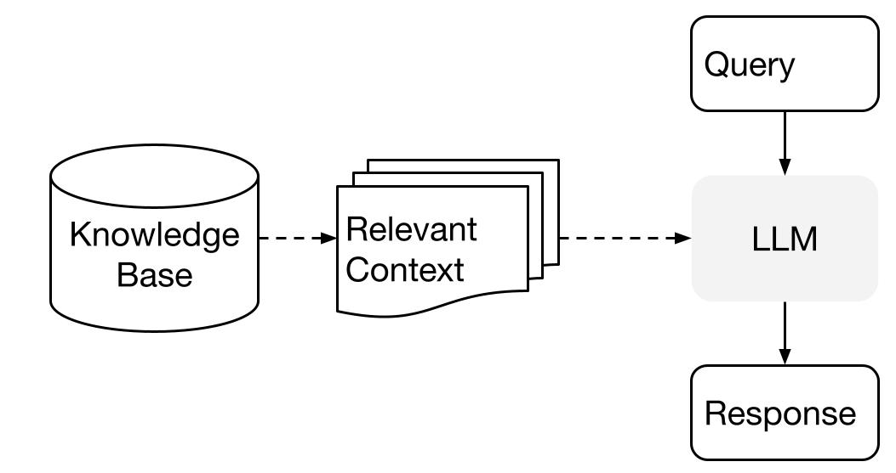
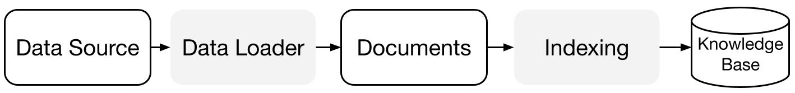
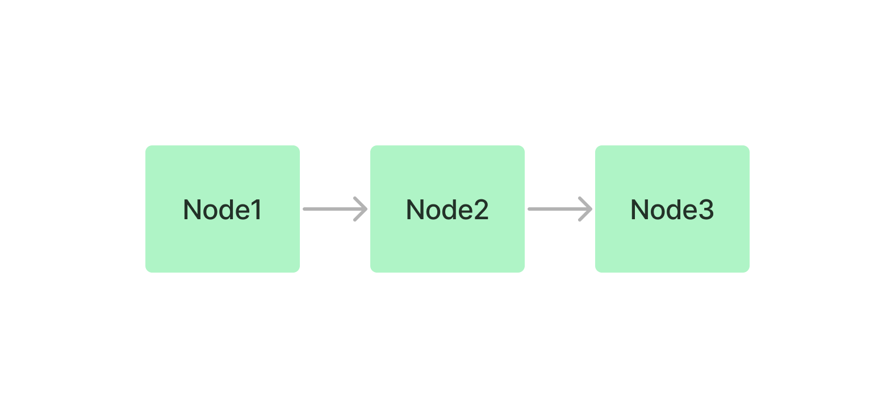
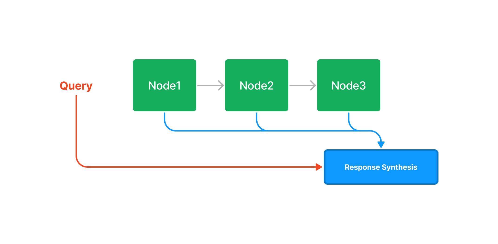
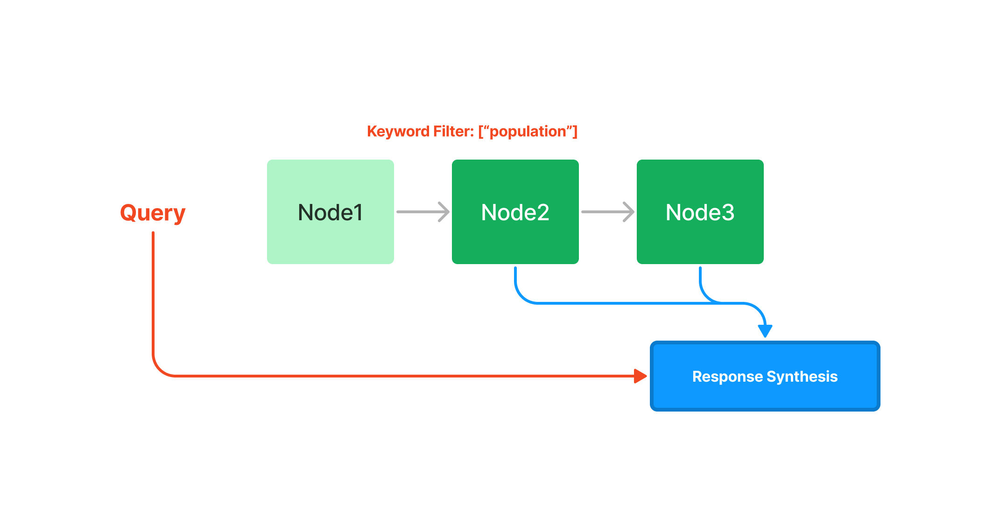
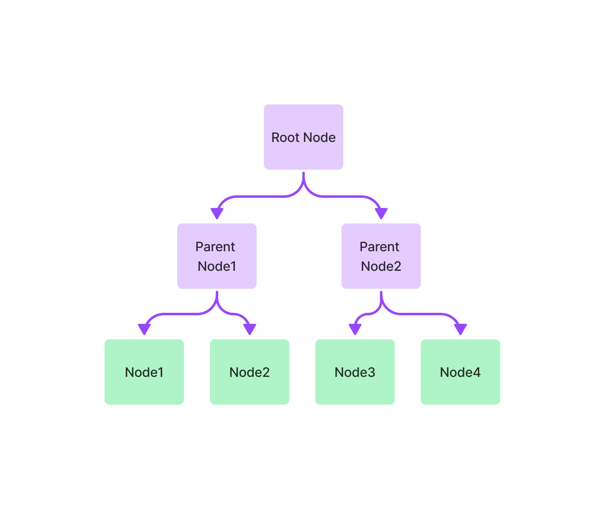
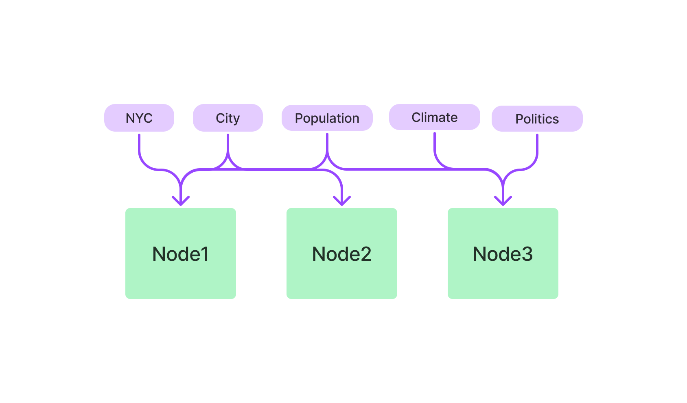

# Table of Contents

- [Table of Contents](#table-of-contents)
- [Introduction to LlamaIndex](#introduction-to-llamaindex)
- [Why use LlamaIndex?](#why-use-llamaindex)
- [LlamaIndex Tools](#llamaindex-tools)
- [Installation and Upgradation](#installation-and-upgradation)
- [High-Level Concepts](#high-level-concepts)
  - [Indexing Stage](#indexing-stage)
  - [Querying Stage](#querying-stage)
- [Internal Mechanism of a LlamaIndex Application](#internal-mechanism-of-a-llamaindex-application)
- [Setting up an Environment](#setting-up-an-environment)
  - [Setting up in Python](#setting-up-in-python)
  - [Setting up in TypeScript](#setting-up-in-typescript)
- [Index / Data Modules](#index--data-modules)
  - [Data Connectors](#data-connectors)
    - [`SimpleDirectoryReader`](#simpledirectoryreader)
  - [Documents / Nodes](#documents--nodes)
    - [Concept: Document](#concept-document)
    - [Concept: Node](#concept-node)
  - [Indices](#indices)
    - [Vectore Store Index](#vectore-store-index)
    - [Summary Index](#summary-index)
    - [Tree Index](#tree-index)
    - [Keyword Table Index](#keyword-table-index)
    - [SQL Index](#sql-index)
  - [Node Parsers](#node-parsers)
  - [Storage](#storage)
    - [Storage: introduction](#storage-introduction)
    - [Storage: Usage](#storage-usage)
    - [Storage: Vector Stores](#storage-vector-stores)
      - [Vector Store: Elasticsearch](#vector-store-elasticsearch)
- [Query Modules](#query-modules)
  - [Main Query Classes](#main-query-classes)
  - [Retrievers](#retrievers)
  - [Query Engines](#query-engines)
    - [Custom Query Engine](#custom-query-engine)
  - [Chat Engines](#chat-engines)
- [Customizing LLM](#customizing-llm)
- [Supporting Modules](#supporting-modules)
  - [Service Context](#service-context)
- [Responses](#responses)
  - [Response Synthesizer](#response-synthesizer)
  - [Streaming Responses for Queries](#streaming-responses-for-queries)
  - [Streaming Responses for Chat](#streaming-responses-for-chat)
  - [Output Parsers](#output-parsers)
    - [LangChain Output Parser](#langchain-output-parser)
- [Prompt Engineering](#prompt-engineering)
- [Token Predictor](#token-predictor)
- [References](#references)

---

# Introduction to LlamaIndex

LlamaIndex (formerly GPT Index) is a data framework for LLM applications to ingest, structure, and access private or domain-specific data.

---

# Why use LlamaIndex?

At their core, **[LLMs](../README.md)** offer a natural language interface between humans and inferred data. Widely available models come pre-trained on huge amounts of publicly available data, from Wikipedia and mailing lists to textbooks and source code.

Applications built on top of LLMs often require augmenting these models with private or domain-specific data. Unfortunately, that data can be distributed across siloed applications and data stores. It’s behind APIs, in SQL databases, or trapped in PDFs and slide decks.

That’s where **LlamaIndex** comes in.

Basically, the idea of LlamaIndex is to leverage a bunch of tools to do the following:

1. To provide a central interface that allows external data to be ingested by the LLM in various data formats to train the model,
2. Provide indices to structured and unstructured data
3. Output from the LLM transferred back to the application.

---

# LlamaIndex Tools

LlamaIndex provides the following tools:

1. **Data Connectors** ingest your existing data from their native source and format. These could be APIs, PDFs, SQL, and (much) more.
2. **Data Indexes** structure your data in intermediate representations that are easy and performant for LLMs to consume.
3. **Engines** provide natural language access to your data. For example:

   - Query engines are powerful retrieval interfaces for knowledge-augmented output.
   - Chat engines are conversational interfaces for multi-message, "back and forth" interactions with your data.

4. **Data Agents** (currently only for the Python version) are LLM-powered knowledge workers augmented by tools, from simple helper functions to API integrations and more.
5. **Application integrations** (currently only for the Python version) tie LlamaIndex back into the rest of your ecosystem. This could be `LangChain`, `Flask`, `Docker`, `ChatGPT`, or… anything else!

---

# Installation and Upgradation

LlamaIndex is available as a package for Python or TypeScript/JavaScript.

**Installation**:

```bash
# For Python
pip install llama-index

# For Node
pnpm add llamaindex
## or
yarn add llamaindex
## or
npm install llamaindex
```

**Upgradation**:

```bash
# For Python
pip install --upgrade llama-index

# For Node
pnpm upgrade llamaindex
## or
yarn upgrade llamaindex
## or
npm upgrade llamaindex
```

---

# High-Level Concepts

LlamaIndex uses a two stage method when using an LLM with your data:

1. **Indexing stage**: ingesting data and preparing a knowledge base, and
2. **Querying stage**: retrieving relevant context from the knowledge base to assist the LLM in responding to a question



This process is also known as **Retrieval Augmented Generation (RAG)**.

LlamaIndex provides the essential toolkit for making both steps super easy.

Let's explore each stage in detail.

---

## Indexing Stage

This stage is about preparing the knowledge base with a suite of data connectors and indexes.



Where,

1. **Data Loaders**: A data connector (i.e. Reader) ingest data from different data sources and data formats into a simple Document representation (text and simple metadata).

2. **Documents / Nodes**: A Document is a generic container around any data source - for instance, a PDF, an API output, or retrieved data from a database. A Node is the atomic unit of data in LlamaIndex and represents a "chunk" of a source Document. It's a rich representation that includes metadata and relationships (to other nodes) to enable accurate and expressive retrieval operations.

3. **Data Indexes**: Once you've ingested your data, LlamaIndex helps you index data into a format that's easy to retrieve.

But why is Indexing necessary?

**Indexing** is necessary because there are some limitations on models as each model can only process upto certain number of tokens (approx 1000 tokens = 750 words). For e.g. when there is a large document with hundreds of lines of text, we cannot use that document as a reference in our query to the LLM as we will exceed this limit.
This is where Indexing comes in.

The document is divided into chunks so as to be within the limit of the LLM model, and then create vector embeddings and store them in a vector database or in memory or disk (knowledge base).

---

## Querying Stage

In the querying stage, the query pipeline retrieves the most relevant context given a user query, and pass that to the LLM (along with the query) to synthesize a response.

This gives the LLM up-to-date knowledge that is not in its original training data, (also reducing [hallucination](../README.md#hallucination)).

The key challenge in the querying stage is retrieval, orchestration, and reasoning over (potentially many) knowledge bases.

LlamaIndex provides composable modules that help you build and integrate RAG pipelines for Q&A (query engine), chatbot (chat engine), or as part of an agent.

These building blocks can be customized to reflect ranking preferences, as well as composed to reason over multiple knowledge bases in a structured way.

---

# Internal Mechanism of a LlamaIndex Application

---

# Setting up an Environment

## Setting up in Python

1. Set up a Python Development Environment

```bash
pipenv install llama-index openai
```

2. Get the OpenAI API Key and create a `.env` file with `OPENAI_API_KEY=<The Api Key>`

---

## Setting up in TypeScript

1. Set up a Node.js Development Environment

```bash
pnpm add llamaindex openai
```

2. Get the OpenAI API Key and create a `.env` file with `OPENAI_API_KEY=<The Api Key>`

---

# Index / Data Modules

## Data Connectors

### `SimpleDirectoryReader`

Used to read directories and files (can read recursively)

---

## Documents / Nodes

### Concept: Document

Document and Node objects are core abstractions within LlamaIndex.

A **Document** is a generic container around any data source - for instance, a PDF, an API output, or retrieved data from a database. They can be constructed manually, or created automatically via our data loaders. By default, a Document stores text along with some other attributes. Some of these are listed below.

- `metadata` - a dictionary of annotations that can be appended to the text.
- `relationships` - a dictionary containing relationships to other Documents/Nodes.

We can manually create a Document or use the Load Data function to create a document automatically.

**In `Python`**,

```py
from llama_index import Document, SimpleDirectoryReader, VectorStoreIndex

# Auto-create Document using load_data() function
documents1 = SimpleDirectoryReader("data").load_data()
## Only one document object is created in this case and it can be easily identified by looking at the  doc_id. This document object stores all lines from the text file.
print(documents1)

# Manually create Document
text_list = ["This is first sentence", "This is second sentence"]
documents2 = [Document(text=t) for t in text_list]
## As we are looping over the text one by one and passing it to Document object, it has created two doc_id, one for each sentence.
print(documents2)

# Build Index
index = VectorStoreIndex.from_documents([*documents, *documents1])
```

**In `TypeScript`**,

```ts
import { Document, VectorStoreIndex } from "llamaindex";
import essay from "./data/essay";

const document = new Document({ text: essay, metadata: { key: "val" } });

const serviceContext = serviceContextFromDefaults({ chunkSize: 512 });

// build index
const index = await VectorStoreIndex.fromDocuments([document], {
  serviceContext,
});
```

---

### Concept: Node

A Node represents a "chunk" of a source Document, whether that is a text chunk, an image, or other. Similar to Documents, they contain metadata and relationship information with other nodes.

Nodes are a first-class citizen in LlamaIndex. You can choose to define Nodes and all its attributes directly. You may also choose to “parse” source Documents into Nodes through our NodeParser classes. By default every Node derived from a Document will inherit the same metadata from that Document (e.g. a “file_name” filed in the Document is propagated to every Node).

```py
from llama_index.node_parser import SimpleNodeParser

# load documents
...

# parse nodes
parser = SimpleNodeParser.from_defaults()
nodes = parser.get_nodes_from_documents(documents)

# build index
index = VectorStoreIndex(nodes)
```

---

## Indices

An **Index** is a data structure that allows us to quickly retrieve relevant context for a user query. For LlamaIndex, it’s the core foundation for retrieval-augmented generation (RAG) use-cases.

At a high-level, Indices are built from **[Documents](#concept-document)**. They are used to build **Query Engines** and **Chat Engines** which enables question & answer and chat over your data.

Under the hood, Indices store data in **[Node](#concept-node)** objects (which represent chunks of the original documents), and expose a **Retriever** interface that supports additional configuration and automation.

**Retrieval Modes**:

An index can have a variety of index-specific retrieval modes. For instance, a `SummaryIndex` supports the `default` `SummaryIndexRetriever` that retrieves all nodes, and `SummaryIndexEmbeddingRetriever` that retrieves the top-k nodes by embedding similarity.

The various Index modules are:

1. **[Vector Store Index](#vectore-store-index)**: Useful for similarity search to find the most similar items to a query in a large dataset.
2. **[Summary Index](#summary-index)**: Useful in use cases where we have to summarize information across data sources.
3. **[Tree Index](#tree-index)**: Useful for summarizing a collection of documents and can be used to generate a hierarchal summary of the data.
4. **[Keyword Table Index](#keyword-table-index)**:
5. KnowledgeGraphIndex
6. Custom Retriever combining KG Index and VectorStore Index
7. Knowledge Graph Query Engine
8. Knowledge Graph RAG Query Engine
9. REBEL + Knowledge Graph Index
10. SQL Index
11. Document Summary Index

---

### [Vectore Store Index](https://gpt-index.readthedocs.io/en/latest/core_modules/data_modules/index/vector_store_guide.html)

**`VectorStoreIndex`** is an abstraction that under the hood, does the following:

1. **Document Preprocessing**: The first step is to preprocess the documents. This includes tokenizing the documents, removing stop words and stemming or lemmatizing the words.
2. **Vectorization**: The next step is to vectorize the documents. This means representing each document as a vector of numbers.
3. **Indexing**: The final step is to index the documents. This means storing the vectors in a database so that they can be quickly retrieved.

By default, **`VectorStoreIndex`** uses a in-memory `SimpleVectorStore` that’s initialized as part of the default storage context.

**`VectorStoreIndex`** can be used with with different vector store implementations:

1. Store vector embeddings in memory
2. Custom vector stores
3. Connect to external vector stores (with existing embeddings)

The `VectorStoreIndex` exposes the `VectorIndexRetriever` which has a default `similarity_top_k` value of 2. This value can be tweaked.
We can also add a Node processor, `SimilarityPostprocessor` that can be used to set a `similarity_cutoff`.

**Example 1**: Create a VectorStoreIndex and run a query with default settings

```py
from llama_index import SimplyDirectoryReader, VectorStoreIndex

# Create document
documents = SimpleDirectoryReader("data").load_data()

# Index Document
index = VectorStoreIndex.from_documents(documents)

# Create Query Engine and run Query
query_engine = index.as_query_engine()
response = query_engine.query("Give me a short summary of the accident rider")
print(response)
```

**Example 2**: Modifying the default `similarity_top_k` and setting a `similarity_cutoff` for the query engine to apply to queries

```py
from llama_index import SimpleDirectoryReader, VectorStoreIndex
from llama_index.retrievers import VectorIndexRetriever
from llama_index.query_engine import RetrieverQueryEngine
from llama_index.indices.postprocessor import SimilarityPostprocessor

# Create Document
documents = SimpleDirectoryReader(
    input_files=["data/accident-benefit-rider-prospectus.pdf"]
).load_data()

# Index Document
index = VectorStoreIndex.from_documents(documents)

# Configure Retriever. Default `similarity_top_k` = 2
retriever = VectorIndexRetriever(index, similarity_top_k=2)

# Apply a `similarity_cutoff`
node_postprocessors = [SimilarityPostprocessor(similarity_cutoff=0.7)]

# Create Query Engine and Query
query_engine = RetrieverQueryEngine(retriever, node_postprocessors=node_postprocessors)
response = query_engine.query("Give me a short summary of the accident rider")
print(response)
```

---

### Summary Index

The Summary Index (earlier called List Index) simply stores Nodes as a sequential chain.



There are two ways of querying within the **`SummaryIndex`**:

1. **Default Query**: During query time, if no other query parameters are specified, LlamaIndex simply loads all Nodes in the list into the **Response Synthesis** module. This is useful in use cases where we have to summarize information.
2. **Embedding-based Query**: Fetch the top-k neighbors.

Both type of queries can be made with or without keyword filters.

**Default Query**:



```py
from llama_index import SimpleDirectoryReader, SummaryIndex
from llama_index.query_engine import RetrieverQueryEngine

# Load Documents
documents = SimpleDirectoryReader("data").load_data()

# Create Summary Index
index = SummaryIndex.from_documents(documents)

# SummaryIndexRetriever (retriever_mode="default")
retriever = index.as_retriever(retriever_mode="default")

# Create Query Engine and Query
query_engine = RetrieverQueryEngine(retriever)
response = query_engine.query("Give me a short summary of the accident rider")
print(response)
```

**Embedding-based Query**:



```py
from llama_index import SimpleDirectoryReader, SummaryIndex
from llama_index.query_engine import RetrieverQueryEngine

# Load Documents
documents = SimpleDirectoryReader("data").load_data()

# Create Summary Index
index = SummaryIndex.from_documents(documents)

# SummaryIndexRetriever (retriever_mode="default")
retriever = index.as_retriever(retriever_mode="default")

# Create Query Engine and Query
query_engine = RetrieverQueryEngine(retriever)
response = query_engine.query("Give me a short summary of the accident rider")
print(response)
```

**Embedding-based Query with Keyword Filter**:

```py
from llama_index import SimpleDirectoryReader, SummaryIndex
from llama_index.indices.postprocessor import KeywordNodePostprocessor
from llama_index.query_engine import RetrieverQueryEngine

# Load Documents
documents = SimpleDirectoryReader("data").load_data()

# Create Summary Index
index = SummaryIndex.from_documents(documents)

# Filters nodes by required_keywords and exclude_keywords
node_postprocessors = [
    KeywordNodePostprocessor(
        required_keywords=["accident"], exclude_keywords=["vibgyor"]
    )
]

# SummaryIndexRetriever (retriever_mode="embedding")
retriever = index.as_retriever(retriever_mode="embedding")

# Create Query Engine and Query
query_engine = RetrieverQueryEngine.from_args(
    retriever, node_postprocessors=node_postprocessors
)
response = query_engine.query("Give me a short summary of the accident rider")
print(response)
```

---

### Tree Index

The Tree Index builds a hierarchical tree from a set of Nodes (which become leaf nodes in this tree).



A Tree Index is useful for summarizing a collection of documents and can be used to generate a hierarchal summary of the data.
Example use cases:

- Table of Contents
- Overview of the main topics in collection of news articles

The `retriever_mode` configuration options for Tree Index:

1. `select_leaf`: `TreeSelectLeafRetriever`
2. `select_leaf_embedding`: `TreeSelectLeafEmbeddingRetriever`
3. `all_leaf`: `TreeAllLeafRetriever`
4. `root`: `TreeRootRetriever`

```py
from llama_index import SimpleDirectoryReader, TreeIndex, StorageContext
from llama_index.query_engine import RetrieverQueryEngine
from llama_index.indices.postprocessor import PrevNextNodePostprocessor

# Create Documents
documents = SimpleDirectoryReader("data").load_data()

# Create a Tree Index
index = TreeIndex.from_documents(documents)

# By default data is stored in-memory. To persist to dist under `./storage`
index.storage_context.persist()

# Create PostProcessor
storage_context = StorageContext.from_defaults(persist_dir="./storage")
docstore = storage_context.docstore
node_postprocessors = [PrevNextNodePostprocessor(docstore=docstore, mode="both")]

# Configure Retriever Mode
retriever = index.as_retriever(retriever_mode="all_leaf")

# Create Query Engine and run Query
query_engine = RetrieverQueryEngine(retriever, node_postprocessors=node_postprocessors)
response = query_engine.query("Create a 'Table of Contents' for the policy. Can have nesting.")
print(response)

"""
1. Max Life - Comprehensive Accident Benefit Rider
   1.1 About Max Life Insurance
   1.2 Max Life Comprehensive Accident Benefit Rider: Protect your family's future
   1.3 Max Life Comprehensive Accident Benefit Rider at a Glance
2. Premium Modes
3. Minimum and Maximum Sum Assured
4. Premium Rate
5. Lapse and Revival
6. Surrender Benefit
7. Maturity Benefit
8. Cash Value
9. Base Policy with which Rider can be attached
10. Benefits Payable
   10.1 Death due to an accident
   10.2 Dismemberment due to an accident
11. How does the Max Life Comprehensive Accident Benefit Rider work for you?
   11.1 Scenario 1: Mr. Kumar meets with a road accident and unfortunately loses both his limbs
   11.2 Scenario 2: Mr. Kumar meets with a road accident and dies due to injuries suffered in it
   11.3 Scenario 3: Mr. Kumar meets with a road accident and unfortunately loses both his limbs, then dies due to another accident
12. Important Notes
   12.1 Tax Benefits
   12.2 Extra premium for substandard lives
13. Few important terms and conditions
   13.1 Statutory impositions
   13.2 Exclusions
"""
```

---

### Keyword Table Index

The keyword table index extracts keywords from each Node and builds a mapping from each keyword to the corresponding Nodes of that keyword.



**Example**:

```py
from llama_index import SimpleDirectoryReader, KeywordTableIndex

# Create Documents
documents = SimpleDirectoryReader(input_files=["data/essay.txt"]).load_data()

# Create Index
index = KeywordTableIndex.from_documents(documents)

# Create Query Engine and run Query
query_engine = index.as_query_engine()
response = query_engine.query("Who are the people the author has interacted with?")
print(response)

# Response:
# --------
## The author has interacted with Robert, Trevor, and Julian, who provided seed funding for their company Viaweb.
```

---

### [SQL Index](https://gpt-index.readthedocs.io/en/latest/examples/index_structs/struct_indices/SQLIndexDemo.html)

---

## Node Parsers

Node parsers are a simple abstraction that take a list of documents, and chunk them into Node objects, such that each node is a specific size. When a document is broken into nodes, all of it’s attributes are inherited to the children nodes (i.e. `metadata`, text and metadata templates, etc.). You can read more about Node and Document properties here.

A node parser can configure the chunk size (in tokens) as well as any overlap between chunked nodes. The chunking is done by using a `TokenTextSplitter`, which default to a chunk size of `1024` and a default chunk overlap of `20` tokens.

**In `Python`**,

```py
from llama_index.node_parser import SimpleNodeParser

node_parser = SimpleNodeParser.from_defaults(chunk_size=1024, chunk_overlap=20)
```

---

## Storage

### Storage: introduction

The default `VectorStoreIndex` creates an In-memory index. In memory index is a quick way to setup however it doesn't provide data persistence. LlamaIndex not only provides us way to create indexes and store them but provides a way to store other aspects of the pipeline into different storage components:

Under the hood, LlamaIndex supports swappable storage components that allows you to customize:

- **Document stores**: where ingested documents (i.e., `Node` objects) are stored,
- **Index stores**: where index metadata are stored,
- **Vector stores**: where embedding vectors are stored.
- **Graph stores**: where knowledge graphs are stored (i.e. for `KnowledgeGraphIndex`).

The Document/Index stores rely on a common Key-Value store abstraction, which is also detailed below.
LlamaIndex supports persisting data to any storage backend supported by **[`fsspec`](https://filesystem-spec.readthedocs.io/en/latest/index.html)**. It supports the following backends:

- Local filesystem
- AWS S3
- Cloudflare R2

---

### Storage: Usage

```py
## build a new index
from llama_index import VectorStoreIndex, StorageContext
from llama_index.vector_stores import DeepLakeVectorStore
# construct vector store and customize storage context
vector_store = DeepLakeVectorStore(dataset_path="<dataset_path>")
storage_context = StorageContext.from_defaults(
    vector_store = vector_store
)
# Load documents and build index
index = VectorStoreIndex.from_documents(documents, storage_context=storage_context)


## reload an existing one
loaded_index = VectorStoreIndex.from_vector_store(vector_store=vector_store)
```

Note that in general to use storage abstractions, you need to define a **`StorageContext`** object:

```py
from llama_index.storage.docstore import SimpleDocumentStore
from llama_index.storage.index_store import SimpleIndexStore
from llama_index.vector_stores import SimpleVectorStore
from llama_index.storage import StorageContext

# create storage context using default stores
storage_context = StorageContext.from_defaults(
    docstore=SimpleDocumentStore(),
    vector_store=SimpleVectorStore(),
    index_store=SimpleIndexStore(),
)
```

---

### Storage: Vector Stores

Vector stores contain embedding vectors of ingested document chunks (and sometimes the document chunks as well).

By default, **`LlamaIndex`** uses a simple in-memory vector store that’s great for quick experimentation. They can be persisted to (and loaded from) disk by calling `vector_store.persist()` (and `SimpleVectorStore.from_persist_path(...)` respectively).

LlamaIndex supports over 20 different vector store options:

| Vector Store             | Type                | Metadata filtering | Hybrid search | Delete | Store Documents | Async |
| ------------------------ | ------------------- | ------------------ | ------------- | ------ | --------------- | ----- |
| Elasticsearch            | self-hosted / cloud | ✔                  | ✔             | ✔      | ✔               | ✔     |
| Pinecone                 | cloud               | ✔                  | ✔             | ✔      | ✔               |       |
| Weaviate                 | self-hosted / cloud | ✔                  | ✔             | ✔      | ✔               |       |
| Postgres                 | self-hosted / cloud | ✔                  | ✔             | ✔      | ✔               | ✔     |
| Cassandra                | self-hosted / cloud | ✔                  |               | ✔      | ✔               |       |
| Qdrant                   | self-hosted / cloud | ✔                  |               | ✔      | ✔               |       |
| Chroma                   | self-hosted         | ✔                  |               | ✔      | ✔               |       |
| Milvus / Zilliz          | self-hosted cloud   | ✔                  |               | ✔      | ✔               |       |
| Typesense                | self-hosted / cloud | ✔                  |               | ✔      | ✔               |       |
| Supabase                 | self-hosted / cloud | ✔                  |               | ✔      | ✔               |       |
| MongoDB Atlas            | self-hosted / cloud | ✔                  |               | ✔      | ✔               |       |
| Redis                    | self-hosted / cloud | ✔                  |               | ✔      | ✔               |       |
| Deeplake                 | self-hosted / cloud | ✔                  |               | ✔      | ✔               |       |
| Opensearch               | self-hosted / cloud | ✔                  |               | ✔      | ✔               |       |
| Neo4jVector              | self-hosted / cloud | ✔                  |               | ✔      | ✔               |       |
| Azure Cognitive Search   | cloud               |                    | ✔             | ✔      | ✔               |       |
| DynamoDB                 | cloud               |                    |               | ✔      |                 |       |
| LanceDB                  | cloud               | ✔                  |               | ✔      | ✔               |       |
| Metal                    | cloud               | ✔                  |               | ✔      | ✔               |       |
| MyScale                  | cloud               |                    |               |        | ✔               |       |
| Tair                     | cloud               | ✔                  |               | ✔      | ✔               |       |
| Simple                   | in-memory           | ✔                  |               | ✔      |                 |       |
| FAISS                    | in-memory           |                    |               |        |                 |       |
| ChatGPT Retrieval Plugin | aggregator          |                    |               | ✔      | ✔               |       |
| DocArray                 | aggregator          | ✔                  |               | ✔      | ✔               |       |

---

#### Vector Store: Elasticsearch

```py
from llama_index import VectorStoreIndex, SimpleDirectoryReader
from llama_index.vector_stores import ElasticsearchStore

# load documents
documents = SimpleDirectoryReader("../data/paul_graham").load_data()

vector_store = ElasticsearchStore(
    es_url="http://localhost:9200",
    # Or with Elastic Cloud
    # es_cloud_id="my_cloud_id",
    # es_user="elastic",
    # es_password="my_password",
    index_name="paul_graham",
)

storage_context = StorageContext.from_defaults(vector_store=vector_store)
index = VectorStoreIndex.from_documents(documents, storage_context=storage_context)

# Querying
# set Logging to DEBUG for more detailed outputs
query_engine = index.as_query_engine()
response = query_engine.query("what were his investments in Y Combinator?")
print(response)
```

---

# Query Modules

## Main Query Classes

Querying an index involves a three main components:

1. **Retrievers**: A retriever class retrieves a set of Nodes from an index given a query.
2. **Response Synthesizer**: This class takes in a set of Nodes and synthesizes an answer given a query.
3. **Engines**:
   - **Query Engine**: This class takes in a query and returns a Response object. It can make use of Retrievers and Response Synthesizer modules under the hood.
   - **Chat Engines**: This class enables conversation over a knowledge base. It is the stateful version of a query engine that keeps track of conversation history.

---

## Retrievers

Retrievers are responsible for fetching the most relevant context given a user query (or chat message).

It can be built on top of **[Indices](#indices)**, but can also be defined independently. It is used as a key building block in **[Query Engines](#query-engines)** (and **[Chat Engines](#chat-engines)**) for retrieving relevant context.

**Example**:

```py
from llama_index import SimpleDirectoryReader, VectorStoreIndex

# Load Documents and Create Index
documents = SimpleDirectoryReader("data").load_data()
index = VectorStoreIndex.from_documents(documents)

# Initialize retriever and use retriever to retrieve nodes
retriever = index.as_retriever()
nodes = retriever.retrieve("Who is Paul Graham?")
```

---

## Query Engines

A Query Engine is a generic interface that allows you to ask question over your data.

A query engine takes in a natural language query, and returns a rich response. It is most often (but not always) built on one or many **[Indices](#indices)** via **[Retrievers](#retrievers)**. You can compose multiple query engines to achieve more advanced capability.

Query engine has a standalone single question and answer format and is not bothered about history.

> If you want to have a conversation with your data (multiple back-and-forth instead of a single question & answer), take a look at **[Chat Engine](#chat-engines)**

**Example**:

```py
# Define Query Engine and run Query
query_engine = index.as_query_engine()
response = query_engine.query("Who is Paul Graham.")
print(response)
```

**Streaming a response**:

```py
# Create Query Engine and run Query. Set `streaming=True`.
query_engine = index.as_query_engine(streaming=True)
response = query_engine.query(
    "What is the common link between all the lines? Suggest 10 other pangrams."
)

# Print the response as it streams
response.print_response_stream()
```

---

### Custom Query Engine

You can (and should) define your custom query engines in order to plug into your downstream LlamaIndex workflows, whether you’re building RAG, agents, or other applications.

**LlamaIndex** provides a `CustomQueryEngine` that makes it easy to define your own queries.

```py
from llama_index import SimpleDirectoryReader, VectorStoreIndex

# Phase 1: Load Data
# ------------------
## Load Documents
documents = SimpleDirectoryReader(input_files=["data/essay.txt"]).load_data()

## Create Index
index = VectorStoreIndex.from_documents(documents)

## Modify retriever
retriever = index.as_retriever()

```

---

## Chat Engines

Chat engine is a high-level interface for having a conversation with your data (multiple back-and-forth instead of a single question & answer). Think ChatGPT, but augmented with your knowledge base.

Conceptually, it is a stateful analogy of a **[Query Engine](#query-engines)**. By keeping track of the conversation history, it can answer questions with past context in mind.

> If you want to ask standalone question over your data (i.e. without keeping track of conversation history), use [Query Engine](#query-engine) instead.

We can tweak the Chat mode by setting the `chat_mode` parameter, depending on whether we want it to be a ChatGPT like open chat, or a contextualized conversation-like chat or whether we want an index to be retrieved and used for the chat. The following `chat_mode` are available:

1. `simple`: Corresponds to `SimpleChatEngine`. Chat with LLM, **_without_** making use of a knowledge base.
2. `condense_question`: Corresponds to `CondenseQuestionChatEngine`. First generate a standalone question from conversation context and last message, then query the query engine for a response. Doesn't use any agent and use case involves when we only want answers from the knowledge base.
3. `context`: Corresponds to `ContextChatEngine`. First retrieve text from the index using the user's message, then use the context in the system prompt to generate a response.
4. `react`: Corresponds to `ReActAgent`. Use a ReAct agent loop with query engine tools. More flexible approach, it can choose between whether to use knowledge base or get the answer from elsewhere. Greater chance to hallucinate, because it'll try to create an answer even if it doesn't exist in the knowledge base. Relies on an Agent to decide which tool to use to get the answer.
5. `openai`: Corresponds to `OpenAIAgent`. Use an OpenAI function calling agent loop. Note: only works with OpenAI models that support function calling API.
6. `best`: Select the best chat engine based on the current LLM. Corresponds to `OpenAIAgent` if using an OpenAI model that supports function calling API, otherwise, corresponds to `ReActAgent`.

**Example 1**: Basic Condense Question Chat (without stream)

```py
from llama_index import SimpleDirectoryReader, SummaryIndex

# Create Document
documents = SimpleDirectoryReader(input_files=["data/essay.txt"]).load_data()

# Create Index
index = SummaryIndex.from_documents(documents)

# Create Chat Engine and start Chat
## `chat_mode` can be any of the following: `best`, `condense_question`, `simple`, `react`, `openai`, `context`
## `condense_question` always queries the knowledge base and cannot contextualize conversation as such except for the last message.
## `verbose=True` lets us know how the engine is thinking, i.e. the actual query it sends after modifying our prompt.
chat_engine = index.as_chat_engine(chat_mode="condense_question", verbose=True)


# Create a mini chat messenger
def prompt():
    question = input("Prompt: ")
    while question.lower() != "exit":
        response = chat_engine.chat(question)
        print(response)
        return prompt()
    return chat_engine.reset()


if __name__ == "__main__":
    prompt()
```

**Example 2**: Condese Question Chat with Stream

```py
from llama_index import SimpleDirectoryReader, VectorStoreIndex

# Create Document
documents = SimpleDirectoryReader(input_files=["data/essay.txt"]).load_data()

# Create Index
index = VectorStoreIndex.from_documents(documents)

# Create Chat Engine and start Chat
## `chat_mode` can be any of the following: `best`, `condense_question`, `simple`, `react`, `openai`, `context`
## `condense_question` always queries the knowledge base and cannot contextualize conversation as such except for the last message.
## `verbose=True` lets us know how the engine is thinking, i.e. the actual query it sends after modifying our prompt.
chat_engine = index.as_chat_engine(chat_mode="condense_question", verbose=True)


# Create a mini chat messenger
def prompt():
    question = input("Prompt: ")
    while question.lower() != "exit":
        streaming_response = chat_engine.stream_chat(question)
        for token in streaming_response.response_gen:
            print(token, end="")
        print("\n")
        return prompt()
    return chat_engine.reset()


if __name__ == "__main__":
    prompt()
```

**Example 3**: React Chat

```py
from llama_index import (
    SimpleDirectoryReader,
    VectorStoreIndex,
    LLMPredictor,
    ServiceContext,
    StorageContext,
    load_index_from_storage,
)
from langchain.chat_models import ChatOpenAI


# Initialize
def initialize():
    global index
    try:
        # load index if already exists
        storage_context = StorageContext.from_defaults(persist_dir="./storage")
        index = load_index_from_storage(storage_context)
    except:
        # otherwise, load documents and create index

        # Create Document
        documents = SimpleDirectoryReader(input_files=["data/essay.txt"]).load_data()

        # Create LLM Predictor
        llm_predictor = LLMPredictor(
            llm=ChatOpenAI(model="gpt-3.5-turbo", temperature=0)
        )

        #
        service_context = ServiceContext.from_defaults(llm_predictor=llm_predictor)

        # Create Index
        index = VectorStoreIndex.from_documents(
            documents=documents,
            service_context=service_context,
            llm_predictor=llm_predictor,
        )


initialize()

# Create Chat Engine and start Chat
## `chat_mode` can be any of the following: `best`, `condense_question`, `simple`, `react`, `openai`, `context`
## `condense_question` always queries the knowledge base and cannot contextualize conversation as such except for the last message.
## `verbose=True` lets us know how the engine is thinking, i.e. the actual query it sends after modifying our prompt.
chat_engine = index.as_chat_engine(chat_mode="react", verbose=True)


# Create a mini chat messenger
def prompt():
    question = input("Prompt: ")
    while question.lower() != "exit":
        response = chat_engine.chat(question)
        print(response)
        return prompt()
    return chat_engine.reset()


if __name__ == "__main__":
    prompt()
```

---

# Customizing LLM

The `llama_index.llms` exposes classes for LLMs, like `OpenAI` which can be used to tweak and customize the default LLM configuration.

```py
from llama_index import SimpleDirectoryReader, ServiceContext, VectorStoreIndex
from llama_index.llms import OpenAI

# Define LLM. By default this has a `temperature` of 0.1 unlike the LangChain version, which has a default of 0.7. You can tweak this.
llm = OpenAI(model="gpt-3.5-turbo")

# Set ServiceContext, which is a utility container for indices and queries
service_context = ServiceContext.from_defaults(llm=llm)

# Create Document
documents = SimpleDirectoryReader(input_files=["data/pangrams.txt"]).load_data()

# Create Index
index = VectorStoreIndex.from_documents(documents, service_context=service_context)

# Create Query Engine and run Query
query_engine = index.as_query_engine()
response = query_engine.query("What is the common link between all the lines?")
print(response)

# Response:
# --------
"""
The common link between all the lines is that they are all sentences or phrases that contain all 26 letters of the English alphabet.
"""
```

---

# Supporting Modules

## Service Context

The **`ServiceContext`** is a bundle of commonly used resources used during the indexing and querying stage in a LlamaIndex pipeline/application. You can use it to set the **global configuration**, as well as **local configurations** at specific parts of the pipeline.

---

# Responses

## [Response Synthesizer](https://gpt-index.readthedocs.io/en/latest/core_modules/query_modules/response_synthesizers/root.html)

A **Response Synthesizer** is what generates a response from an LLM, using a user query and a given set of text chunks. The output of a response synthesizer is a Response object.

The method for doing this can take many forms, from as simple as iterating over text chunks, to as complex as building a tree. The main idea here is to simplify the process of generating a response using an LLM across your data.

When used in a query engine, the response synthesizer is used after nodes are retrieved from a `retriever`, and after any `node_postprocessors` are ran.

1. Standalone Usage
2. Usage with a Query Engine

The `response_mode` available are:

1. `default`: "create and refine" an answer by sequentially going through each retrieved Node; This makes a separate LLM call per Node. Good for more detailed answers.
2. `compact`: "compact" the prompt during each LLM call by stuffing as many Node text chunks that can fit within the maximum prompt size. If there are too many chunks to stuff in one prompt, “create and refine” an answer by going through multiple prompts.
3. `tree_summarize`: Given a set of Node objects and the query, recursively construct a tree and return the root node as the response. Good for summarization purposes.
4. `no_text`: Only runs the retriever to fetch the nodes that would have been sent to the LLM, without actually sending them. Then can be inspected by checking response.source_nodes. The response object is covered in more detail in Section 5.
5. `accumulate`: Given a set of Node objects and the query, apply the query to each Node text chunk while accumulating the responses into an array. Returns a concatenated string of all responses. Good for when you need to run the same query separately against each text chunk.

**Example 1**: Standalone Usage

```py
from llama_index.schema import Node
from llama_index.response_synthesizers import ResponseMode, get_response_synthesizer

response_synthesizer = get_response_synthesizer(response_mode=ResponseMode.COMPACT)

response = response_synthesizer.synthesize("query text", nodes=[Node(text="text"), ...])
print(reponse)
```

**Example 2**: Usage with a Query Engine

```py
query_engine = index.as_query_engine(response_synthesizer=response_synthesizer)
response = query_engine.query("query_text")
```

---

## Streaming Responses for Queries

Streaming responses allow you to start printing or processing the beginning of the response before the full response is finished. This drastically reduces the latency in getting a response and there is some output visible on the screen as the output is printed, providing a better experience for the developer or end user.

To enable streaming, you need to use an LLM that supports streaming. Right now, streaming is supported by **OpenAI**, **HuggingFaceLLM**, and most **LangChain LLMs** (via `LangChainLLM`).

If you are using the high-level API, set `streaming=True` when building a query engine.

**Example**: Using **`OpenAI`**

```py
from llama_index import SimpleDirectoryReader, ServiceContext, VectorStoreIndex
from llama_index.llms import OpenAI

# Define LLM. By default this has a `temperature` of 0.1 unlike the LangChain version, which has a default of 0.7. You can tweak this.
llm = OpenAI(model="gpt-3.5-turbo")

# Set ServiceContext, which is a utility container for indices and queries
service_context = ServiceContext.from_defaults(llm=llm)

# Create Document
documents = SimpleDirectoryReader(input_files=["data/pangrams.txt"]).load_data()

# Create Index
index = VectorStoreIndex.from_documents(documents, service_context=service_context)

# Create Query Engine and run Query. Set `streaming=True`.
query_engine = index.as_query_engine(streaming=True)
response = query_engine.query(
    "What is the common link between all the lines? Suggest 10 other pangrams."
)

# Print the stream response
response.print_response_stream()
```

---

## Streaming Responses for Chat

Check **Example 2** in [Chat Engine](#chat-engine)

---

## Output Parsers

**LlamaIndex** supports integrations with output parsing modules offered by other frameworks. These output parsing modules can be used in the following ways:

- To provide formatting instructions for any prompt / query (through `output_parser.format`)
- To provide "parsing" for LLM outputs (through `output_parser.parse`)

### LangChain Output Parser

**`Langchain`** offers output parsing modules that you can use within **`LlamaIndex`**.

````py
from llama_index import VectorStoreIndex, SimpleDirectoryReader, ServiceContext
from llama_index.output_parsers import LangchainOutputParser
from llama_index.llm_predictor import StructuredLLMPredictor
from llama_index.prompts import PromptTemplate
from llama_index.prompts.default_prompts import (
    DEFAULT_TEXT_QA_PROMPT_TMPL,
    DEFAULT_REFINE_PROMPT_TMPL,
)
from langchain.output_parsers import StructuredOutputParser, ResponseSchema


# load documents, build index
documents = SimpleDirectoryReader("data").load_data()
index = VectorStoreIndex.from_documents(documents)
llm_predictor = StructuredLLMPredictor()

# define output schema
response_schemas = [
    ResponseSchema(
        name="Education",
        description="Describes the author's educational experience/background.",
    ),
    ResponseSchema(
        name="Work", description="Describes the author's work experience/background."
    ),
]

# define output parser
lc_output_parser = StructuredOutputParser.from_response_schemas(response_schemas)
output_parser = LangchainOutputParser(lc_output_parser)

# format each prompt with output parser instructions
fmt_qa_tmpl = output_parser.format(DEFAULT_TEXT_QA_PROMPT_TMPL)
fmt_refine_tmpl = output_parser.format(DEFAULT_REFINE_PROMPT_TMPL)
qa_prompt = PromptTemplate(fmt_qa_tmpl, output_parser=output_parser)
refine_prompt = PromptTemplate(fmt_refine_tmpl, output_parser=output_parser)

# query index
query_engine = index.as_query_engine(
    service_context=ServiceContext.from_defaults(llm_predictor=llm_predictor),
    text_qa_template=qa_prompt,
    refine_template=refine_prompt,
)
response = query_engine.query(
    "What are a few things the author?",
)
print(response)

# Response
"""
```json
{
        "Education": "The author initially planned to study philosophy in college but switched to AI.",
        "Work": "The author has worked on building the infrastructure of the web, publishing essays online, spam filters, and painting."
}
```
"""
````

---

# Prompt Engineering

In **`LlamaIndex`** there are two types of Prompts

1. Default Prompts: Found in `llama_index.prompts.default_prompts`

   - Non-Chat Prompts
   - Chat Prompts

2. Custom Prompts
   - text_qa_template
   - refine_template

Prompts can be modified at two places:

- **Index construction**:

```py
# Via the default nodes constructor
index = TreeIndex(nodes, summary_template=<custom_prompt>)
```

```py
# Via the documents constructor
index = TreeIndex.from_documents(documents,summary_template=<custom_prompt>)
```

- **Query Engine**:

```py
# Via the High-level API
query_engine = index.as_query_engine(
  text_qa_template=<custom_qa_prompt>
  refine_template=<custom_refine_template>
)
```

```py
# Via the Low-Level Composition API using `RetrieverQueryEngine`
retriever = index.as_retriever()
response_synthesizer = get_response_synthesizer(
    text_qa_template=<custom_qa_prompt>
    refine_template=<custom_refine_template>
)

query_engine = RetrieverQueryEngine(reriever, response_synthesizer=response_synthesizer)

# Alternatively the templates can be passed directly into the `RetrieverQueryEngine`
query_engine = RetrieverQueryEngine.from_args(
    retriever,
    text_qa_template=QA_TEMPLATE,
    refine_template=REFINE_TEMPLATE,
    verbose=True,
)
```

---

# Token Predictor

We can use the Token Predictor to predict the token usage before actually performing the operation.

There are two kinds of token predictions we can do:

1. **`MockLLMPredictor`**: Total token usage
2. **`MockEmbedding`**: total embedding token usage

```py
# As of llama_index v0.8.29.post1
from llama_index import VectorStoreIndex, SimpleDirectoryReader, ServiceContext
from llama_index.llms import MockLLM
from llama_index import MockEmbedding
from llama_index.callbacks import CallbackManager, TokenCountingHandler
import tiktoken

# Create a token_counter and add it to the callback_manager
token_counter = TokenCountingHandler(
    tokenizer=tiktoken.encoding_for_model("gpt-3.5-turbo").encode
)
callback_manager = CallbackManager([token_counter])

# Load Documents
documents = SimpleDirectoryReader("data").load_data()

# Index Documents
index = VectorStoreIndex.from_documents(documents)

# Create Predictors
llm = MockLLM(max_tokens=256)
embed_model = MockEmbedding(embed_dim=1536)

# Service Context
service_context = ServiceContext.from_defaults(
    # llm_predictor=llm_predictor,
    llm=llm,
    embed_model=embed_model,
    callback_manager=callback_manager,
)

# Query Engine
query_engine = index.as_query_engine(service_context=service_context)

# Run Query
response = query_engine.query("Describe the author's activities")

# Response
print("LLM Prompt Tokens: ", token_counter.prompt_llm_token_count)
print("LLM Completion Tokens: ", token_counter.completion_llm_token_count)
print("Total LLM Token Count: ", token_counter.total_llm_token_count)
print("Total Embedding Token Usage: ", token_counter.total_embedding_token_count)

"""
LLM Prompt Tokens:  1982
LLM Completion Tokens:  256
Total LLM Token Count:  2238
Total Embedding Token Usage:  0
"""
```

---

# References

- [LLamaIndex Docs](https://gpt-index.readthedocs.io/en/latest/) | [LlamaIndex.ts](https://ts.llamaindex.ai) | Latest Docs
- [LlamaHub](https://llamahub.ai) | A large (and growing!) collection of custom data connectors
- [LlamaLab](https://github.com/run-llama/llama-lab) | Ambitious projects built on top of LlamaIndex
- [Building Performant RAG Applications](https://gpt-index.readthedocs.io/en/latest/end_to_end_tutorials/dev_practices/production_rag.html)
